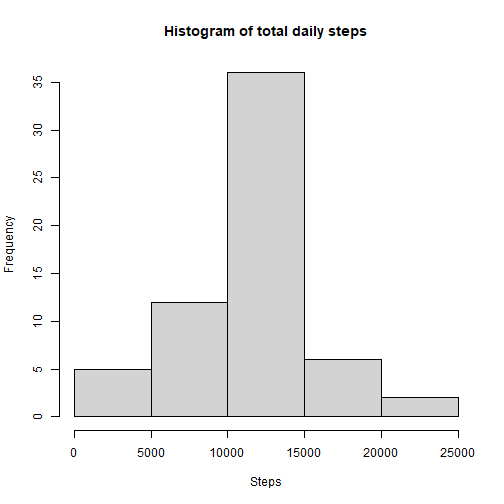
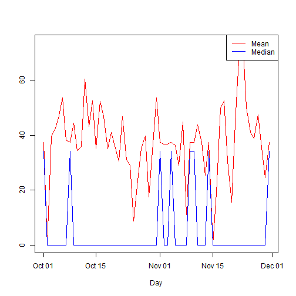

Course Project 1
===================

Read data set


```r
    data <- read.csv("./activity.csv",header=TRUE)
    data$date <- as.Date(data$date,format = "%Y-%m-%d")
```

##Question 1: Histogram of total steps per day 

```r
    data = transform(data,date=factor(date))
    steps <- tapply(data$steps,data$date,sum,na.rm=TRUE)
    hist(steps)
```


##Question 2: Mean and median of total daily steps

```r
    clean <- data[!is.na(data$steps),]
    clean = transform(clean,date=factor(date))
    mean <- tapply(clean$steps,clean$date,mean)
    median <- tapply(clean$steps,clean$date,median)
    plot(as.Date(levels(clean$date)),mean,type="o",xlab="Day",ylab="",
         lwd=2,pch=8,col="red")
    lines(as.Date(levels(clean$date)),median,type="o",xlab="Day",ylab=""
         ,lwd=2,pch=8,col="blue")
    legend("topright",col=c("red","blue"),legend=c("Mean","Median"),
           lty=c(1,1))
```


##Question 3: Timeseries of the daily activity pattern

```r
    clean = transform(clean,interval=factor(interval))
    pattern <- tapply(clean$steps,clean$interval,mean)
    plot(levels(clean$interval),pattern,type="l",xlab="Interval",
         ylab="Average number of steps",main="Daily activity pattern")
```


##Question 4: 5-Minute interval that contains the maximum number of steps

```r
    new <- data.frame(levels(clean$interval),pattern)
    names(new) <- c("Interval","Steps")
    print(new[new$Steps==max(new$Steps),])
```

```
##     Interval    Steps
## 835      835 206.1698
```

##Question 5: Imputing missing values  
There are **2304** missing values.


```r
    steps <- {}
    for (i in seq(1,length(data$steps))){
      if (is.na(data$steps[i])) {
        int <- data$interval[i]
        steps <- c(steps,new[new$Interval==int,2]) 
      }
      else {
        steps <- c(steps,data$steps[i])
      }
    }
    nomiss <- data.frame(data$date,steps,data$interval)
    names(nomiss) <- c("date","steps","interval")
    total <- with(nomiss,tapply(steps,date,sum))
    hist(total,xlab="Steps",main="Histogram of total daily steps")
```



```r
    mean <- tapply(nomiss$steps,nomiss$date,mean)
    median <- tapply(nomiss$steps,nomiss$date,median)
    plot(as.Date(levels(nomiss$date)),mean,type="l",
         col="red",xlab="Day",ylab="")
    lines(as.Date(levels(nomiss$date)),median,col="blue")
    legend("topright",col=c("red","blue"),legend=c("Mean","Median"),
           lty=c(1,1))
```



Based on the strategy that was used, the mean value didn't change. However, the median value changed from a zero vector to a non-zero.

##Question 6: Difference between weekdays and weekends

```r
    check <- function(x){
       week <- c("Monday","Tuesday","Wednesday","Thursday","Friday")
       if (weekdays(x) %in% week) {
         y <- "weekday"
       }
       else {
         y <- "weekend"
       }
       return(y)
    }
    library(ggplot2)
    nomiss$period <- sapply(as.Date(nomiss$date),check)
    nomiss = transform(nomiss,period=factor(period))
    avg <- with(nomiss,aggregate(steps,
                  list(Interval=interval,Period=period),mean))
    g <- ggplot(avg,aes(x=Interval,y=x))
    g+geom_line()+facet_grid(Period~.)+ylab("Number of Steps")+theme_bw()+
      theme(strip.background = element_rect(fill="pink"))
```


